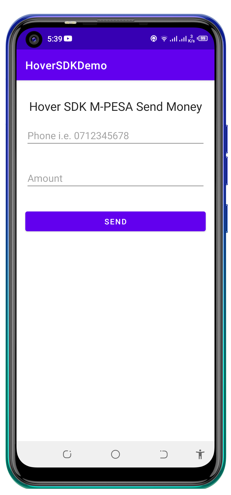
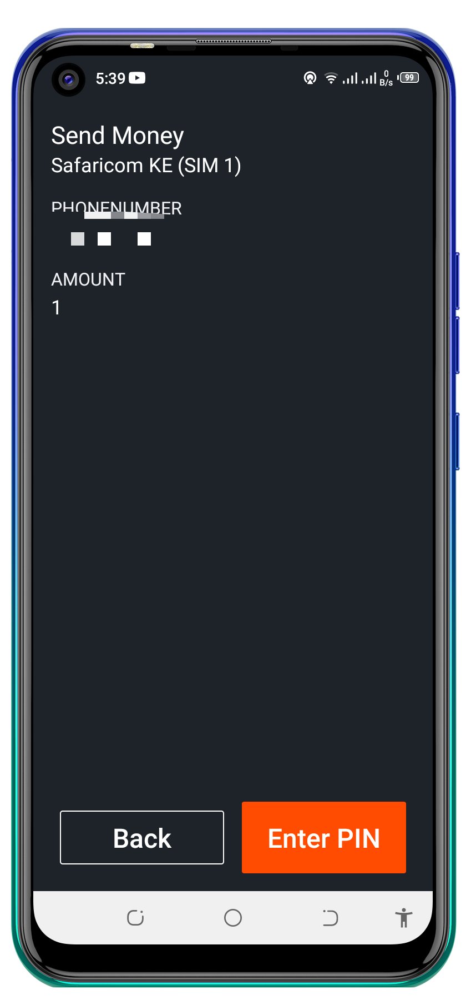
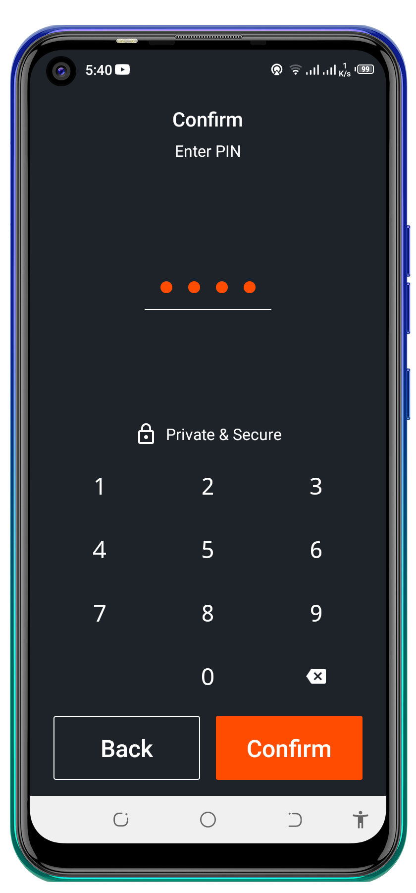
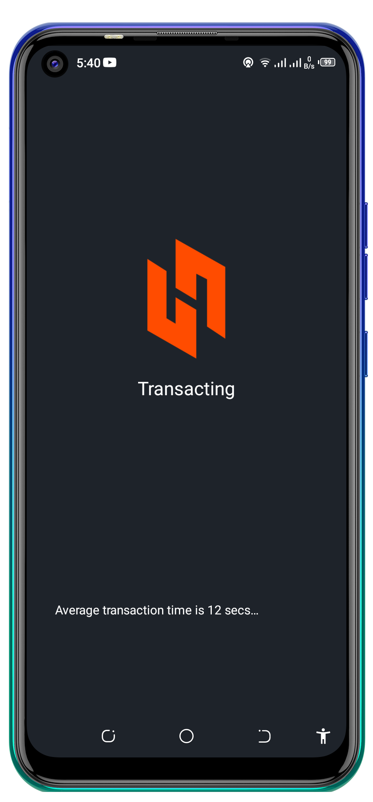
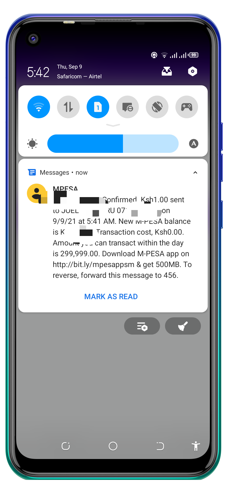

## HoverSDKDemo
Hover helps developers automate USSD sessions in the background of Android applications. Our Android SDK can run virtually any USSD interaction on any mobile operator anywhere in the world. This includes payments, airtime topup, bill pay and more.

>Note: Remember to create your own Hover app on the Hover Dashboard and create your action with steps
You'll replace here with your ActionID

```kotlin
val intent = HoverParameters.Builder(this)
                    .request("ActionID")  //Action ID
                    .extra("phoneNumber", binding.editTextPhoneNumber.text.toString().trim())
                    .extra("amount", binding.editTextAmount.text.toString().trim())
                    .buildIntent()
```

## Init Hover
`Hover.initialize(this)`

## Run the USSD Session
```kotlin
binding.buttonSend.setOnClickListener {
            try {
                val intent = HoverParameters.Builder(this)
                    .request("14c45f2e")  //Action ID
                    .extra("phoneNumber", binding.editTextPhoneNumber.text.toString().trim())
                    .extra("amount", binding.editTextAmount.text.toString().trim())
                    .buildIntent()

                startActivityForResult(intent, 0)
            } catch (e: Exception) {
                Toast.makeText(this@MainActivity, "Hover Error", Toast.LENGTH_SHORT).show()
            }
        }
```

## Listen for USSD Information
```kotlin
override fun onActivityResult(requestCode: Int, resultCode: Int, data: Intent?) {
        super.onActivityResult(requestCode, resultCode, data)
        try {
            if (requestCode == 0 && resultCode == RESULT_OK) {

                Toast.makeText(
                    this,
                    "You will receive an MPESA Confirmation message shortly",
                    Toast.LENGTH_SHORT
                ).show()

            } else if (requestCode == 0 && resultCode == RESULT_CANCELED) {

                Toast.makeText(this, data?.getStringExtra("error"), Toast.LENGTH_SHORT).show()
                Log.d(TAG, "onActivityResult: ${data?.getStringExtra("error")}")
            }
        } catch (e: Exception) {
            Log.d(TAG, "onActivityResult: ${e.localizedMessage}")
        }
    }
```

## Demo
<p float="left">





  </p>
